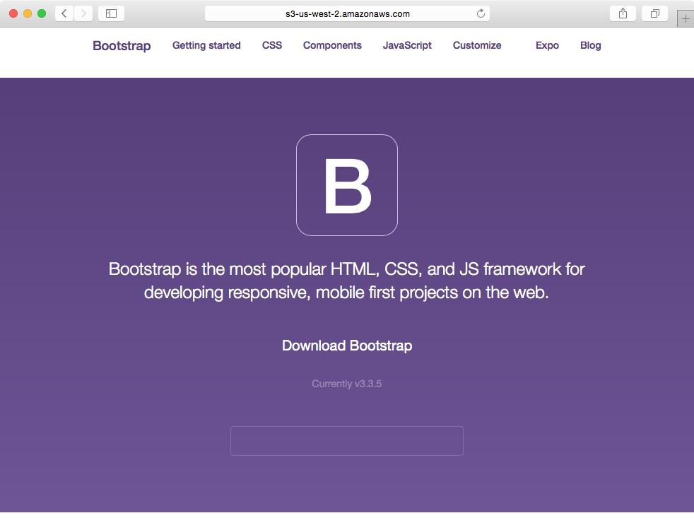
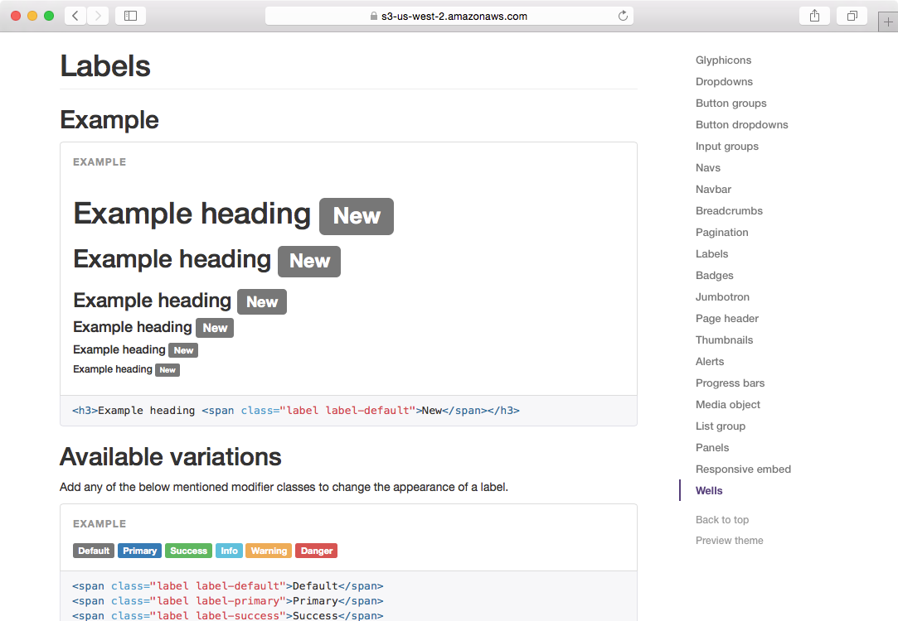
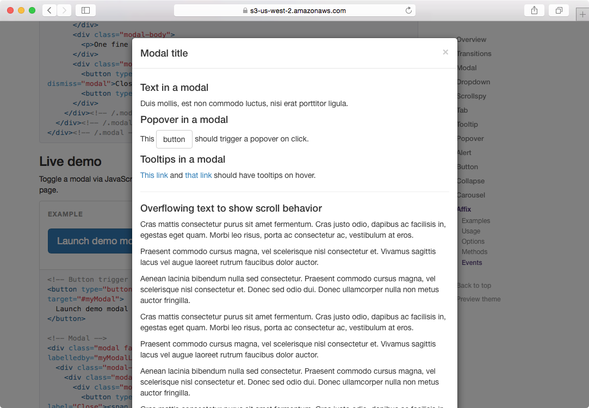
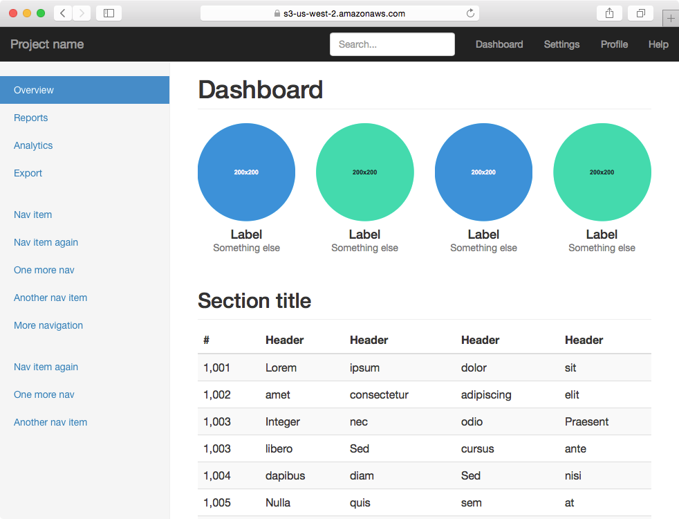
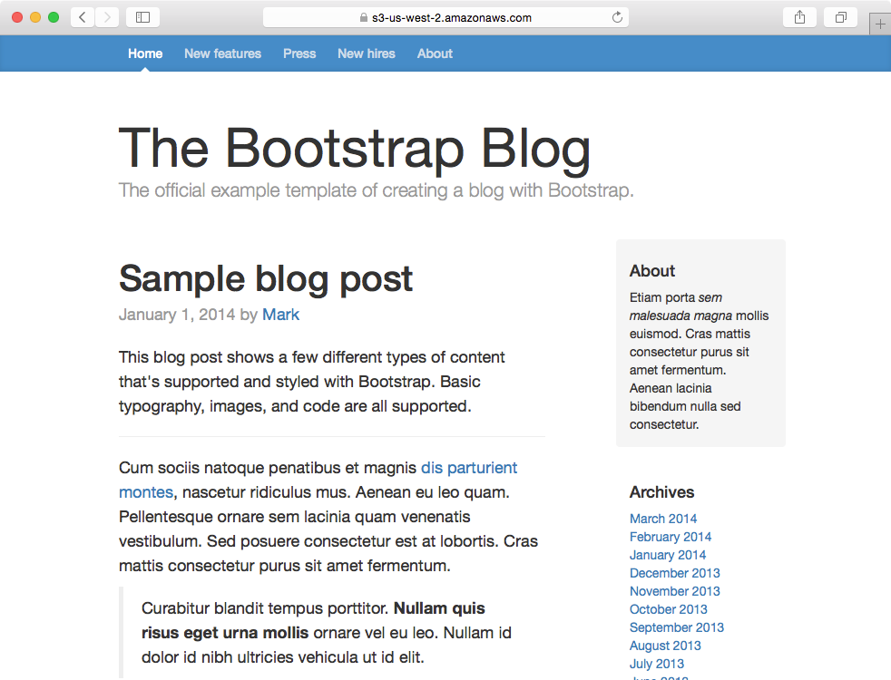

Demonstration of Twbs Documentation and Hiram Pages
=======

This fork of Twitter Bootstrap is used to test compatibility of Twitter Bootstrap sites with [Hiram Pages](https://www.hirampages.com) Bucket.

We do so by building the documentation, adding the [Hiram Pages Bridge](https://github.com/hiramsoft/hp-bridge) inline at *hp-bridge.html*,
and then publishing to a sample bucket.

Why?

By testing the documentation, which includes a comprehensive set of examples, we can assess how well most Bootstrap sites
will work with Hiram Pages.  In general, most of Twitter Bootstrap works with Hiram Pages.

The original project is at [https://github.com/twbs/bootstrap](https://github.com/twbs/bootstrap).

Important Caveats
-------
For some of the JavaScript-based features, Bootstrap stores URLs inside data-* tags.  The Hiram Pages Bridge
does not look for URLs inside data-* tags and as a result the following components do not work:

* Affix
* Scrollspy

Otherwise the examples in the documentation all appear to work.

Testing yourself
-------

How to get the Bootstrap Docs working in your bucket:

0. You may need to `gem install rouge`
1. Install Jekyll
2. Install AWS CLI
3. Edit run-demo.sh use your bucket.  By default run-demo builds the documentation.
4. Run *run-demo.sh*
5. Go to Hiram Pages to create an "HP Bridge Static Site" link

Testing your own Bootstrap Site
-------

If you have a static website based on Bootstrap,
skip this project altogether,
and add the [Hiram Pages Bridge](https://github.com/hiramsoft/hp-bridge) inline at *hp-bridge.html*
to your project.

That's it.

Screenshots
-------

These screenshots reflect what you should see:

When this static website is hosted on S3 and locked by Hiram Pages, only people you allow may view the blog.
